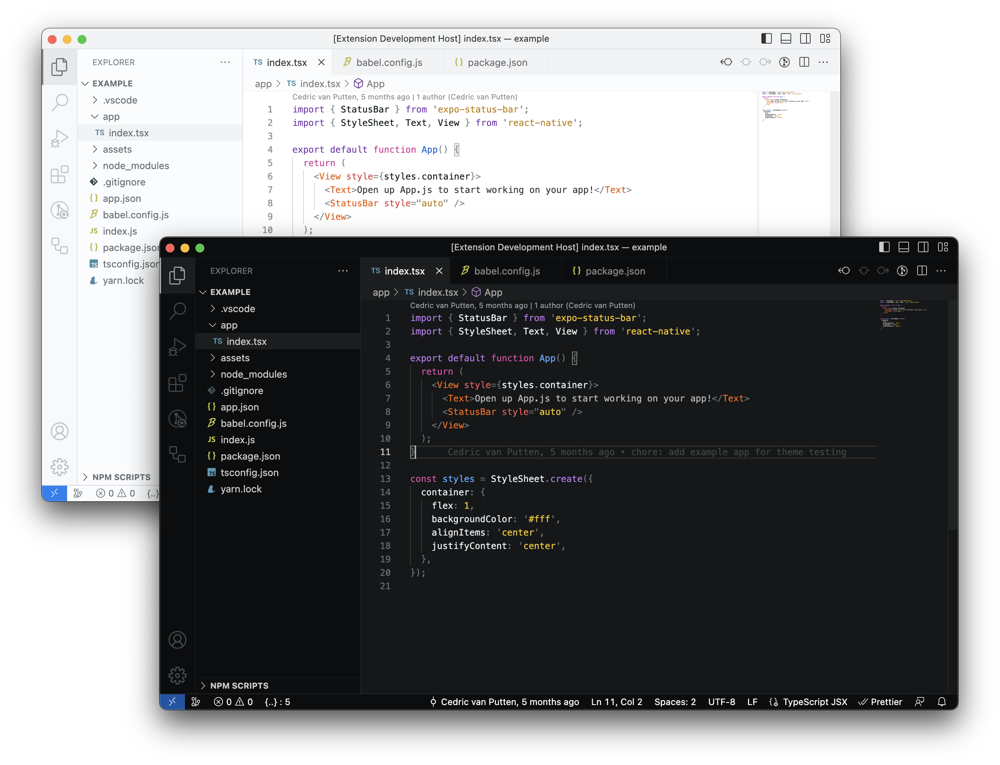

<h1 align="center">

Expo VS Code themes

  
  
  
  

</h1>

## Install

1. Go to [VS Marketplace](https://marketplace.visualstudio.com/items?itemName=expo.vscode-expo-theme) or [Open VSX Registry](https://open-vsx.org/extension/expo/vscode-expo-theme).
2. For **VS Marketplace**:
   * Click on the "Install" button

   For **Open VSX Registry**:
   * Click on the "Download" button
   * In VS Code, go to "Extensions" tab
   * Click "More" button (three dots in the right corner of header) and select "Install from VSIX"
   * Select downloaded VSIX file from step above
3. Then, in VS Code [select one of themes](https://code.visualstudio.com/docs/getstarted/themes#_selecting-the-color-theme):
   - `Expo Dark`
   - `Expo Light`

## Customize the theme

You can override the theme in your personal config file, please follow the guide in the [VS Code documentation](https://code.visualstudio.com/api/extension-guides/color-theme).

